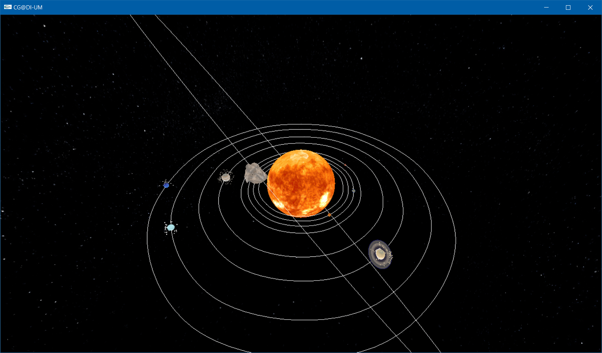
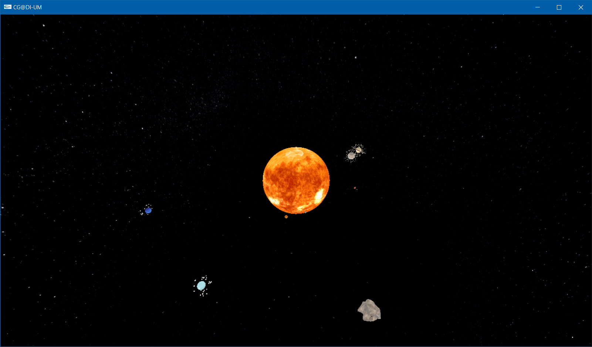
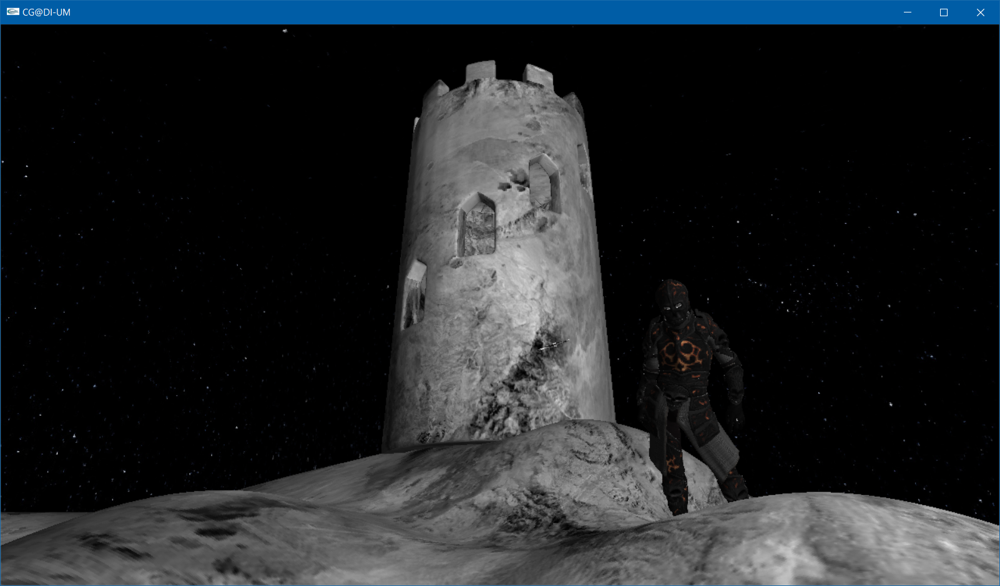
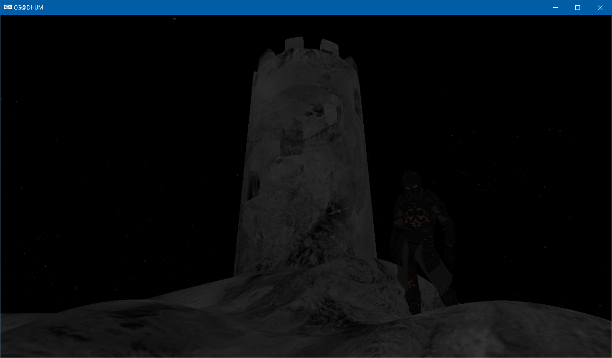
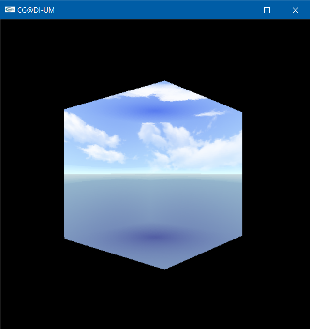
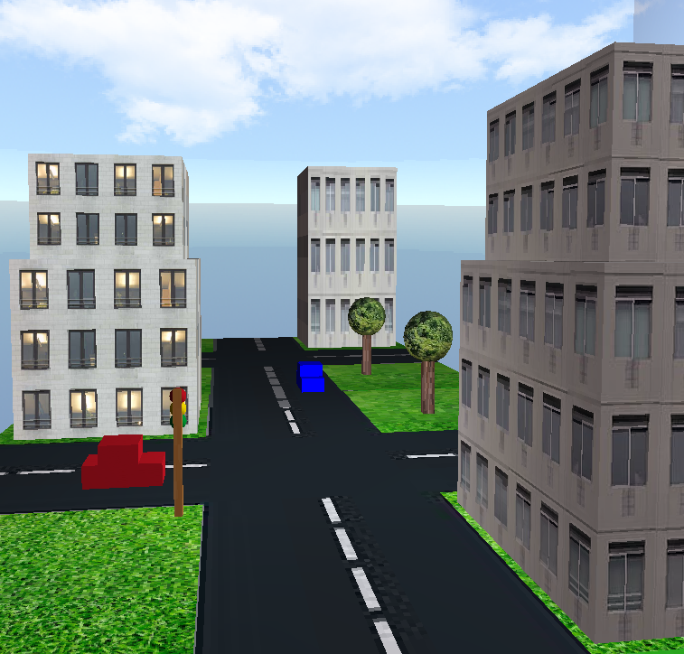

# CG2223
CONTROLOS
| TECLA | MODO | DESCRIÇÃO |
| --- | ---- | -------------------|
|  T  | 1/2 | Mostar/Esconder os Eixos |
|  G  | 1/2 | Mostar/Esconder as Linhas criadas pelos translates ao longo do tempo |
|  H  | 1/2 | Mudar o modo Polygon (GL\_FILL, GL\_POINT, GL\_LINE) |
|  R  | 1/2 | Mudar de Modo | 
|  W  | 1 | Vai para cima, mas continua a olhar para o mesmo sitio |
|  S  | 1 | A câmera vai para baixo, mas continua a olhar para o mesmo sitio |
|  A  | 1 | A câmera vai para a esquerda, mas continua a olhar para o mesmo sitio |
|  D  | 1 | A câmera vai para a direita, mas continua a olhar para o mesmo sitio |
|  Z  | 1 | Zoom |
|  X  | 1 | Unzoom |
|  W  | 2 | Mover em frente |
|  S  | 2 | Mover para trás |
|  A  | 2 | Mover para a esquerda |
|  D  | 2 | Mover para a direita |
|  V  | 2 | Mover para cima |
|  C  | 2 | Mover para baixo |

| Número | Nome |
| ------- | ---- |
|  a96434  | Francisca Quintas Monteiro de Barros |
|  a94870  | Rafael Picão Ferreira Correia        |
|  a97588  | Joana Isabel Freitas Pereira         |
